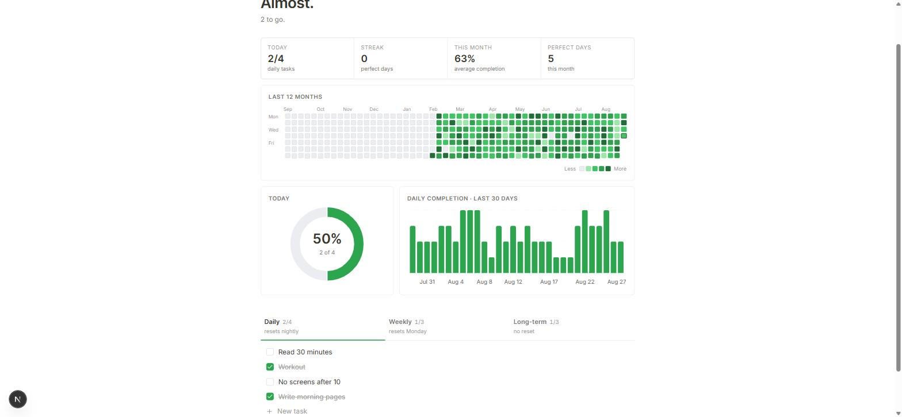

**Did you do it today?**

A personal to-do list that keeps score. Tasks are templates, not one-shot rows —
a daily task's checkbox resets every night, and every tick is written to a
permanent log. The charts at the top read that log, so the page can tell you not
just what's left today but whether you've actually been following through.

Single page, Notion-quiet, light and dark. Built for one person.



---

## What it does

- **Three lists as swipeable tabs** — Daily, Weekly, Long-term — one at a time.
  Swipe, drag, arrow-key, or click a tab; the underline tracks the scroll.
- **Checkboxes that reset on their own.** Daily at midnight, Weekly on Monday.
  Long-term is one-off: check once, done.
- **A contribution heatmap** over the last 12 months, shaded by what share of
  that day's daily tasks you finished.
- **Today's donut**, a 30-day completion trend, and a stat strip with your current
  streak and this month's average.
- **Magic-link sign-in**, so the same list follows you between computers.

## Stack

Next.js 16 (App Router) · React 19 · TypeScript · Tailwind v4 · shadcn/ui on Base
UI · Recharts · Supabase (Postgres + Auth).

---

## Setup

### 1. Create a Supabase project

[database.new](https://database.new) → new project. Any region, any name.

### 2. Create the tables

Open the project's **SQL Editor**, paste the whole of
[`supabase/schema.sql`](supabase/schema.sql), and run it. That creates both
tables, their indexes, and the row-level security policies.

The RLS policies are not optional. Without them any signed-in user could read
every row in the table.

### 3. Point the app at it

```bash
cp .env.local.example .env.local
```

Fill in the two values from **Project Settings → API**:

| Variable | Where to find it |
| --- | --- |
| `NEXT_PUBLIC_SUPABASE_URL` | "Project URL" |
| `NEXT_PUBLIC_SUPABASE_PUBLISHABLE_KEY` | The browser-safe key — labelled **publishable** on newer projects, **anon public** on older ones. Either works. |

Never put the `service_role` key in here. It bypasses RLS.

### 4. Allow the sign-in redirect

**Authentication → URL Configuration**, add to *Redirect URLs*:

```
http://localhost:3000/**
```

Add your deployed URL there too once you have one.

### 5. Run it

```bash
npm install
npm run dev
```

Open <http://localhost:3000>, enter your email, click the link in your inbox.

> Before you've done the steps above, `/` shows setup instructions instead of
> crashing, and **`/preview`** renders the full interface driven by a year of
> generated data — no database, no sign-in. It's a development-only route and
> 404s in production.

### 6. Lock it to you

Once you're signed in, go to **Authentication → Sign In / Providers** and turn
off **Allow new users to sign up**. Otherwise anyone who finds your deployed URL
can create an account. Their data stays private to them thanks to RLS, but
there's no reason to let them in.

### Optional: sign-in links that work in any browser

Out of the box the magic link uses Supabase's PKCE flow, which only completes in
the browser that requested it — open the link on your phone after requesting it
on your laptop and it fails.

To fix that, go to **Authentication → Email Templates → Magic Link** and replace
the body with:

```html
<h2>Sign in to DYDIT</h2>
<p><a href="{{ .SiteURL }}/auth/confirm?token_hash={{ .TokenHash }}&type=email">Sign in</a></p>
```

That routes to `/auth/confirm`, which verifies the token directly and works from
anywhere. Both routes ship, so this is safe to do at any point — or not at all.

---

## How the recurrence works

Two tables:

**`tasks`** are the templates you edit. Each has a `cadence`, which is both how
often it resets *and* which of the three tabs it appears in — a list is its reset
rule, so there is no separate `section` column to keep in sync.

**`completions`** is an append-only log. Each row says *this task was completed
for this period*:

| cadence | list | `period_key` |
| --- | --- | --- |
| daily | Daily | `2026-08-26` |
| weekly | Weekly | `2026-W35` (ISO week) |
| once | Long-term | `once` |

A unique index on `(task_id, period_key)` is the whole mechanism. Yesterday's
tick is stored under yesterday's key, so it can't satisfy today — which is what
makes the checkbox appear to reset, without any scheduled job.

Unchecking deletes the row. Removing a task **archives** it rather than deleting
it, so last month's perfect days stay perfect.

### Everything is computed in local time

Period keys are derived in the browser, never on the server. A server in UTC has
already rolled over to tomorrow while it's still 7pm where you are, and a task
you just ticked would render unticked. `lib/periods.ts` does all the date math in
local time and the server stores whatever key the client computed.

The cost is that the charts wait one frame after mount before rendering, which is
why they briefly show a skeleton.

### What the heatmap actually measures

Each cell is the share of that day's **daily** tasks you completed, bucketed into
five levels. Weekly and monthly items are deliberately excluded from the shade —
including them would make Mondays look better than Tuesdays purely because
weeklies reset — but they still show in the cell's tooltip.

A day with no daily tasks at all reads as "no data", not as a zero. Tasks only
count from the day they were created, so adding a task today doesn't retroactively
ruin last week.

---

## Deploying

Push to GitHub, import at [vercel.com/new](https://vercel.com/new), and add the
same two environment variables. Then add your production URL to Supabase's
Redirect URLs (step 4).

---

## Project map

```
app/
  page.tsx            auth guard, fetches raw rows
  actions.ts          add / tick / archive
  login/              magic-link form
  preview/            dev-only design harness with sample data
  auth/confirm/       token_hash verification  (works in any browser)
  auth/callback/      PKCE code exchange       (zero-config fallback)
proxy.ts              session refresh + route guard
lib/
  periods.ts          local-time period keys, ISO weeks
  stats.ts            heatmap buckets, streaks, averages — all pure
  supabase/           browser, server, and proxy clients
components/           dashboard, charts, tabs, task rows
supabase/schema.sql   tables, indexes, RLS
scripts/stats.test.ts fixture check for the date and streak math
```

`lib/stats.ts` is pure functions over plain arrays, so the awkward parts — streak
edges, archived tasks, ISO week boundaries — are checked without a database:

```bash
npx tsx scripts/stats.test.ts
```

---

## The name

DYDIT — *did you do it today?* The mark is a to-do box with its top-right corner
left open, and the check sweeping out through the gap.
